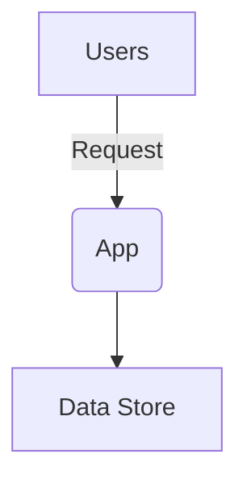

# 02 – Architecture Overview

**Project Name:** {{projectName}}

## Context Diagram

_Replace with an appropriate system or context diagram._

## Key Components

| Component  | Responsibility |
| ---------- | -------------- |
| API Server |                |
| Frontend   |                |
| Database   |                |

## Tech Stack Choices

- Language: <!-- e.g., TypeScript, Go, Python -->
- Framework: <!-- e.g., Express, Django -->
- Database: <!-- e.g., Postgres, DynamoDB -->

## Scaling & Reliability Considerations

- Horizontal scaling strategy
- Fault tolerance / HA setup
- Rate limiting / throttling

## Security Considerations

- Authentication & Authorization
- Data encryption (in transit / at rest)
- Secrets management

## Deployment Architecture

Describe how the system is deployed across environments (dev, staging, prod), including CI/CD pipelines.

---

_Document generated by lets-vibe._
