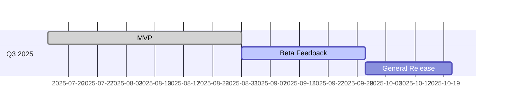

# Roadmap & Milestones

> High-level view of upcoming work for **{{projectName}}**. Update at the end of each sprint / iteration.

## Current Phase

| Phase | Start      | End        | Goals                      |
| ----- | ---------- | ---------- | -------------------------- |
| MVP   | YYYY-MM-DD | YYYY-MM-DD | Deliver core functionality |

## High-Level Timeline

## Backlog Themes

- **User onboarding** – registration, auth, profile settings.
- **Performance** – caching, DB tuning.
- **Observability** – metrics, dashboards.

## Change Log

| Date       | Change                  | Author |
| ---------- | ----------------------- | ------ |
| YYYY-MM-DD | Initial roadmap created |        |

---

_Document generated by lets-vibe. Keep dates in ISO-8601 format._
