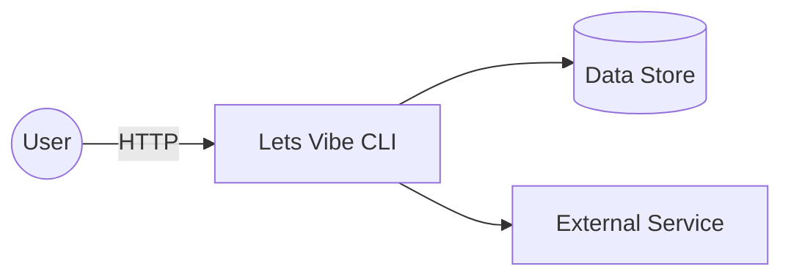
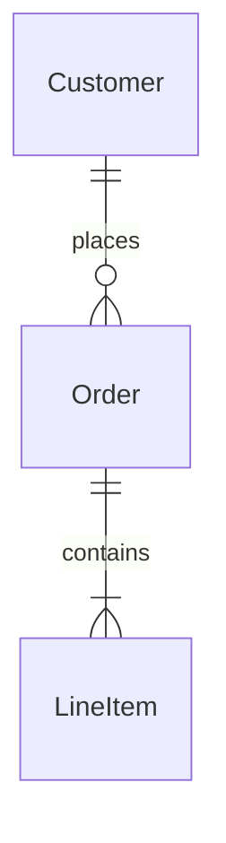

# 02 – Software Architecture

**Project Name:** Lets Vibe CLI

> “All architecture is design, but not all design is architecture.” – Grady Booch

---

## 1. System Context

Describe how the system fits into the larger ecosystem.

| Actor / System   | Interaction                 |
| ---------------- | --------------------------- |
| User             | Consumes web/mobile UI      |
| External Service | Provides payment processing |

## 2. Functional Requirements (High-Level)

1. FR-1 – …
2. FR-2 – …

## 3. Non-Functional Requirements

| Category     | Requirement            | Target          |
| ------------ | ---------------------- | --------------- |
| Performance  | P95 response < 300 ms  | 95th percentile |
| Availability | 99.9 % uptime          | monthly         |
| Security     | OWASP Top-10 compliant | continuous      |

## 4. Logical Architecture

List the main subsystems/components and their responsibilities.

| Component   | Responsibility      | Tech       | CRUD on Data |
| ----------- | ------------------- | ---------- | ------------ |
| API Gateway | AuthN/Z, rate-limit | AWS API GW | –            |
| Service X   | Business logic      | Node.js    | Orders       |

Add a component diagram or C4 "Container" diagram as appropriate.

## 5. Data Model & Storage

Describe key domain entities and their relationships.

| Entity   | Notes |
| -------- | ----- |
| Order    | …     |
| Customer | …     |

## 6. Interface & API Contracts

| API          | Verb | Path    | Request / Response |
| ------------ | ---- | ------- | ------------------ |
| Create Order | POST | /orders | JSON body          |

Include JSON schema or OpenAPI links if available.

## 7. Technology Decisions

| Concern  | Choice     | Alternatives | Rationale         |
| -------- | ---------- | ------------ | ----------------- |
| Language | TypeScript | Go, Java     | Team expertise    |
| DB       | PostgreSQL | DynamoDB     | ACID transactions |

## 8. Quality Attributes & Tactics

- **Scalability** – horizontal scaling via containers
- **Availability** – multi-AZ deployment
- **Maintainability** – modular service boundaries
- **Security** – JWT auth, TLS everywhere

## 9. Deployment & Operations

| Environment | URL                     | Infra Stack     | Notes           |
| ----------- | ----------------------- | --------------- | --------------- |
| Staging     | https://stg.example.com | Terraform + ECS | CI auto-deploy  |
| Prod        | https://app.example.com | Terraform + ECS | Manual approval |

Include a deployment diagram if useful.

## 10. Observability

| Signal  | Tool       | Alert Threshold  |
| ------- | ---------- | ---------------- |
| Logs    | CloudWatch | error rate > 1 % |
| Metrics | Prometheus | latency > 300 ms |
| Traces  | Jaeger     | sampled 1 %      |

## 11. Risks & Mitigations

| Risk              | Likelihood | Impact | Mitigation          |
| ----------------- | ---------- | ------ | ------------------- |
| Single AZ failure | Low        | High   | Multi-AZ deployment |

## 12. Open Questions

1. Should we adopt event sourcing?
2. Which API versioning strategy (URI vs Header)?

---

_Document generated by lets-vibe. Remove sections that don't apply._
