# 04 – Deployment, Operations & Reliability

**Project Name:** Lets Vibe CLI

> This document explains **how** we ship Lets Vibe CLI to users, keep it running, and recover when things go wrong.

---

## 1. Environments & Promotion Flow

| Env            | URL / Endpoint          | Git Branch   | Purpose        | Promotion Step     |
| -------------- | ----------------------- | ------------ | -------------- | ------------------ |
| **Preview**    | auto-generated          | PR branch    | Per-PR testing | Destroyed on merge |
| **Staging**    | https://stg.example.com | `main`       | QA / UAT       | Auto from CI       |
| **Production** | https://app.example.com | `production` | Live traffic   | Manual approval    |

```mermaid
flowchart LR
    commit[Merge to main] --> ci(📦 CI Build)
    ci --> stg(🚀 Deploy to Staging)
    stg --> approval{Manual Approval?}
    approval -->|yes| prod(🚀 Deploy to Prod)
```

## 2. CI/CD Pipeline

| Step              | Tool            | Notes                              |
| ----------------- | --------------- | ---------------------------------- |
| Lint & Unit Tests | GitHub Actions  | Runs on every push                 |
| Build Artifact    | Docker + Buildx | Multi-arch image published to GHCR |
| Integration Tests | Playwright      | Runs against docker-compose stack  |
| Deploy Staging    | Argo CD         | Auto-sync enabled                  |
| Deploy Prod       | Argo CD         | Requires manual `sync`             |

## 3. Infrastructure Overview

_Add a high-level diagram or link to Terraform / Pulumi repo._

| Layer    | Tech                  | Notes               |
| -------- | --------------------- | ------------------- |
| Compute  | AWS ECS Fargate       | 2× t3.medium per AZ |
| Database | Amazon RDS Postgres   | Multi-AZ, encrypted |
| Cache    | AWS ElastiCache Redis | Clustered           |
| Storage  | S3                    | Backups & assets    |

## 4. Configuration & Secrets

| Mechanism     | Tool                | Source of Truth           |
| ------------- | ------------------- | ------------------------- |
| Env Vars      | SSM Parameter Store | CI injects at deploy time |
| Secrets       | AWS Secrets Manager | Rotated every 90 days     |
| Feature Flags | LaunchDarkly        | SDK key from Secrets      |

## 5. Rollback & Disaster Recovery

| Scenario      | Detection                        | Action                                  | RTO / RPO       |
| ------------- | -------------------------------- | --------------------------------------- | --------------- |
| Bad release   | Elevated 5xx & error budget burn | `argo rollback` to previous Image tag   | < 15 min / none |
| Region outage | AWS Health events                | Failover to standby region via Route 53 | < 1 hr / 1 hr   |

DB backups: automated nightly snapshots retained 30 days; point-in-time recovery enabled.

## 6. Observability

| Signal  | Tool                  | SLO / Alert          |
| ------- | --------------------- | -------------------- |
| Metrics | Prometheus            | P95 latency < 300 ms |
| Logs    | Loki / Grafana        | Error rate > 1 %     |
| Traces  | OpenTelemetry → Tempo | N/A                  |

Dashboards live in Grafana folder "Lets Vibe CLI". PagerDuty rotation: _backend-oncall_.

## 7. Security & Compliance

- TLS everywhere (ACM certificates)
- Images scanned via Trivy in CI
- IAM least privilege; roles defined in `terraform/iam.tf`
- SOC 2 evidence collected automatically via Drata

## 8. Cost Management

| Service | Monthly Budget | Tracking Method           |
| ------- | -------------- | ------------------------- |
| ECS     | $400           | AWS Budgets alert at 80 % |
| RDS     | $300           |                           |

Regular cost review on the first business day of each month.

## 9. Open Questions / Future Work

1. Do we need blue-green or canary deploys for Prod?
2. Evaluate switching to Graviton instances for cost savings.

---

_Document generated by lets-vibe. Adapt tooling names and numbers to your stack / org._
